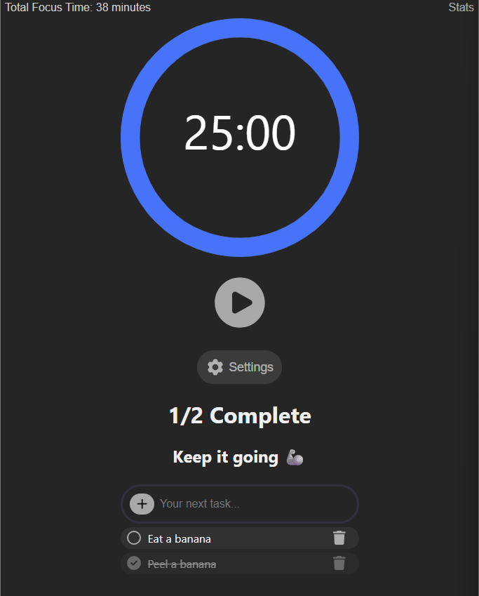

# 🍅 Tomato Time

A simple and well-built Pomodoro timer to help you stay focused and productive.

[Tomato Time Live Site 🍅](https://tomato-time1.netlify.app/)




## 🧠 Motivation
I always use a Pomodoro timer when I'm grinding through programming sessions. It helps me avoid burnout and maintain a high volume of productive focus time. Tomato Time was built to provide a customizable, intuitive timer with just enough features to stay on track—without getting in the way.


## ✨ Features

- ⏱ Pomodoro sessions (25 minutes)

- ☕ Short (5 min) and long breaks (15 min)
- 🔄 Auto-cycle or manual control
- 📃 Built-in To-Do List with total completed count and motivational messages
- ⚙️ Customizable session lengths in Settings
- 🔔 Simple sound effects for transitions
- ⏳ Timer animation for visual progress
- 🚦 Browser tab title updates based on session
- 📊 Focus statistics tracking the past 7 days


## 🛠️ Technologies Used

- React (with Hooks)

- JavaScript (ES6+)
- HTML5 + CSS3
- NPM packages
- LocalStorage for persistence
- Netlify for deployment


## 📦 Installation

To run Tomato Time locally:

```bash
# Clone the repo
git clone https://github.com/VinnieCodes/tomato-time.git

# Navigate into the project directory
cd tomato-time

# Install dependencies
npm install

# Start the development server
npm start
